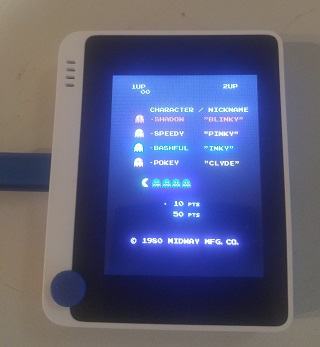
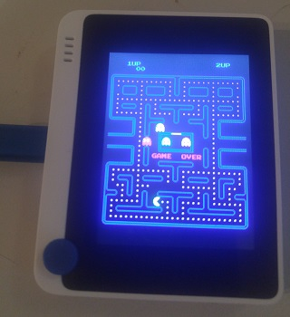
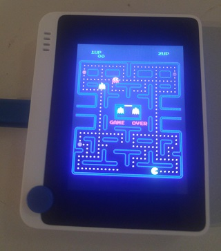

Pac Man
========

Pacman emulation on
[WIO Terminal](https://wiki.seeedstudio.com/Wio-Terminal-Getting-Started/)

Based on https://github.com/jscrane/pacman which inturn was based on Frisnit's [Pac Man Emulator](http://www.frisnit.com/pac-man-machine-emulator/)

Useful reference, as was Chris Lomont's [Pac Man emulation 
guide](http://www.lomont.org/Software/Games/PacMan/PacmanEmulation.pdf).
(Reproduced [here](docs/PacmanEmulation.pdf).)

The game runs in portrait mode the button positions will be on top right side of the WIO. Numbered 1, 2, 3 from top to bottom.

Controls
--------
- Button 1: One-player start
- Button 2: Two-player start
- Button 3: Coin
- Joystick: Up, down, left, right

Screenshots
-----------

  
